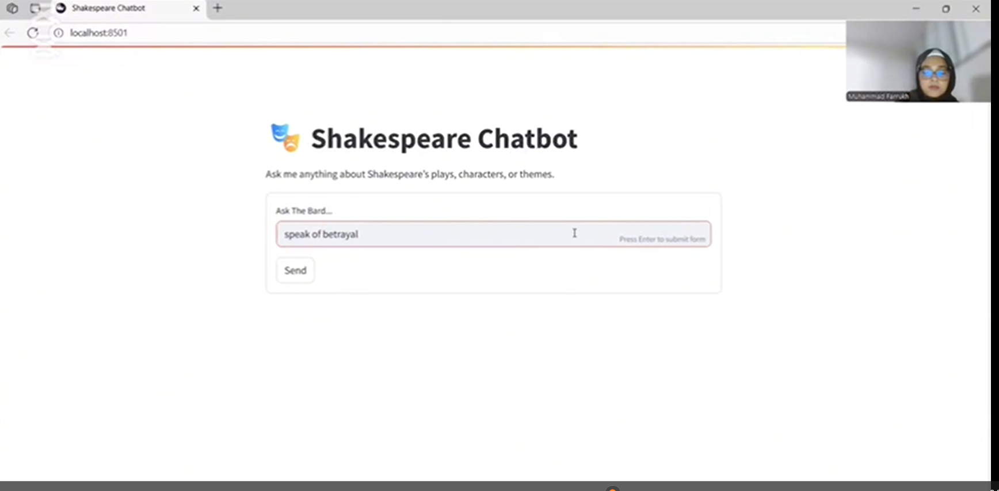
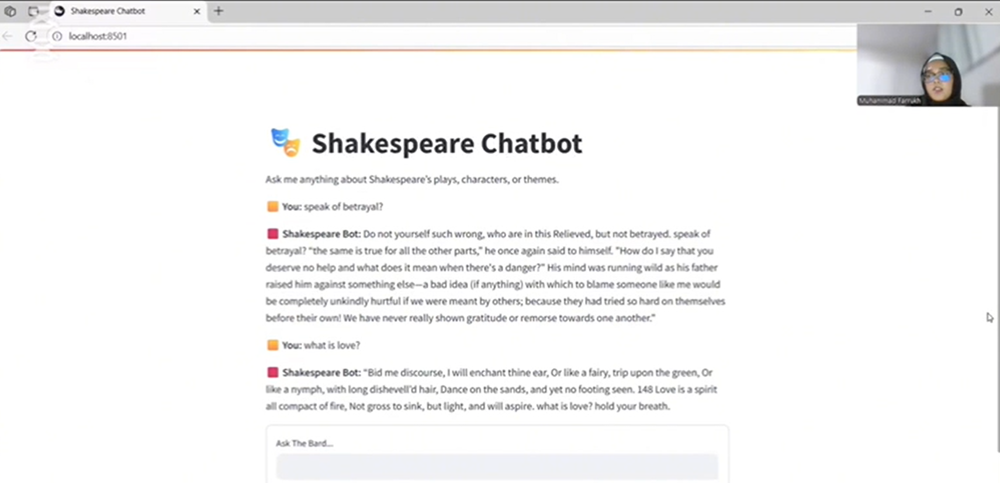

# Intelligent Shakespeare Chatbot

An interactive Shakespeare-focused chatbot that uses semantic search to understand a user's topic or question and retrieve relevant quotations from Shakespeare's works.

The project demonstrates how natural-language processing, sentence embeddings, vector search, and a Streamlit interface can be combined to create a lightweight domain-specific chatbot.

## Project Overview

The Intelligent Shakespeare Chatbot allows users to search Shakespearean quotations using natural-language queries.

Instead of requiring the user to enter the exact wording of a quotation, the chatbot understands the semantic meaning of the query. For example, a user can search for topics such as love, ambition, betrayal, friendship, power, or jealousy, and the system retrieves the most relevant quotations from the available Shakespeare dataset.

The application uses a pre-built FAISS vector index to compare the user's query with embedded Shakespearean quotations. The most relevant results are then displayed through an interactive Streamlit interface.

## How the Chatbot Works

The chatbot follows the workflow below:

```text
User enters a question, topic, or keyword
                  ↓
The query is converted into a numerical embedding
                  ↓
FAISS compares the query embedding with stored quote embeddings
                  ↓
The most semantically similar Shakespeare quotations are retrieved
                  ↓
The results are displayed in the Streamlit application
```

### Step 1: User Input

The user enters a topic, keyword, or natural-language question through the Streamlit interface.

Example queries include:

```text
love
```

```text
betrayal
```

```text
Give me a Shakespeare quote about ambition.
```

```text
Find a quotation related to friendship and loyalty.
```

### Step 2: Query Embedding

The user's text is converted into a numerical vector using a sentence-embedding model.

The embedding represents the semantic meaning of the query rather than relying only on exact keyword matching.

### Step 3: Vector Similarity Search

The query embedding is passed to the FAISS vector index.

FAISS compares the user query with the stored embeddings of Shakespearean quotations and identifies the quotations with the highest semantic similarity.

### Step 4: Quote Retrieval

The indices of the most relevant results are used to retrieve the corresponding quotations from the processed quote dataset.

The quotation data is stored in the `quotes.pkl` file.

### Step 5: Result Display

The selected quotations are displayed to the user through the Streamlit interface.

This provides a simple conversational experience for exploring Shakespeare's language, themes, and quotations.

## Key Features

* Natural-language quotation search
* Semantic search instead of exact keyword matching
* FAISS-based vector similarity retrieval
* Preprocessed Shakespearean quotation dataset
* Interactive Streamlit web interface
* Fast local retrieval
* Lightweight modular Python implementation
* Topic-based exploration of Shakespeare's works
* Support for queries related to themes, emotions, and ideas

## Technologies Used

| Technology            | Purpose                                         |
| --------------------- | ----------------------------------------------- |
| Python                | Core application development                    |
| Streamlit             | Interactive web interface                       |
| FAISS                 | Vector similarity search                        |
| Sentence Transformers | Creation of text embeddings                     |
| Pickle                | Storage and loading of processed quotation data |
| NumPy                 | Vector and numerical processing                 |
| Hugging Face          | Access to language and embedding models         |

## System Architecture

```text
Shakespearean Text and Quotations
                 ↓
        Text Preprocessing
                 ↓
       Sentence Embeddings
                 ↓
         FAISS Vector Index
                 ↓
          User Search Query
                 ↓
        Query Vector Embedding
                 ↓
      Semantic Similarity Search
                 ↓
       Relevant Quote Retrieval
                 ↓
        Streamlit User Interface
```

## Repository Structure

```text
Shakespeare-Chatbot/
│
├── streamlit_app.py
├── retrieve_quotes.py
├── generator.py
├── requirements.txt
├── README.md
├── quotes.pkl
│
├── screenshots/
│   ├── chatbot-home.png
│   ├── chatbot-response.png
│   └── chatbot-results.png
│
├── Demo/
│   └── shakespeare-chatbot-demo.mp4

```

## File Description

| File                      | Description                                                    |
| ------------------------- | -------------------------------------------------------------- |
| `streamlit_app.py`        | Creates and runs the chatbot's Streamlit interface             |
| `retrieve_quotes.py`      | Processes the user query and retrieves relevant quotations     |
| `generator.py`            | Contains quotation-processing or response-generation logic     |
| `quotes.pkl`              | Stores the processed Shakespearean quotation records           |
| `requirements.txt`        | Lists the Python libraries required by the project             |
| `.gitignore`              | Prevents local and unnecessary files from being uploaded       |
| `screenshots/`            | Contains screenshots showing the chatbot interface and results |
| `Demo/`                   | Contains the chatbot demonstration video                       |
|

## Application Screenshots

### Chatbot Interface



### Example Search Result




## Demo Video

A demonstration of the chatbot is available below:

[Watch the Shakespeare Chatbot Demo](Demo/ Chatbot demo)

## Example Use Case

Suppose the user enters:

```text
Give me a Shakespeare quote about ambition.
```

The system performs the following operations:

1. Reads the query from the Streamlit interface.
2. Converts the query into a sentence embedding.
3. Searches the FAISS index for similar quotation embeddings.
4. Identifies the highest-ranking quotation matches.
5. Loads the corresponding quotations from `quotes.pkl`.
6. Displays the results in the chatbot interface.

This approach allows the chatbot to retrieve relevant quotations even when the user's wording is different from the original Shakespearean text.

## Why Semantic Search Was Used

Traditional keyword search only finds results containing the same words entered by the user.

For example, searching for `sadness` may not retrieve a quotation containing words such as `sorrow`, `grief`, or `despair`.

Semantic search addresses this limitation by comparing the meaning of the query with the meaning of each quotation. This enables the chatbot to return conceptually related results even when the exact words do not match.

## Role of FAISS

FAISS is used to store and search quotation embeddings efficiently.

The quotation embeddings are generated before the application runs and saved in the `shakespeare_index.faiss` file. When a user submits a query, only the query needs to be embedded. FAISS then searches the existing index and returns the nearest quotation vectors.

This design improves response speed because the entire dataset does not need to be processed again for every search.

## Role of the Pickle Dataset

The `quotes.pkl` file stores the processed quotation text and associated information.

FAISS returns the numerical positions of the closest vectors. These positions are matched with the records stored in `quotes.pkl` so that the actual quotation text can be shown to the user.

## Project Objectives

The main objectives of this project were to:

* Build a lightweight domain-specific chatbot
* Explore Shakespearean text through natural-language queries
* Implement semantic retrieval using text embeddings
* Use FAISS for efficient vector search
* Develop a simple and accessible web interface
* Reduce irrelevant responses through retrieval-based processing
* Demonstrate the practical use of NLP in a literary application

## Challenges Addressed

### Exact Keyword Dependence

The chatbot avoids relying only on exact word matching by using semantic embeddings.

### Retrieval Speed

The FAISS index enables efficient searching across stored quotation vectors.

### Limited Computing Resources

The application uses a lightweight retrieval architecture that can run locally without requiring a large generative model for every response.

### User Accessibility

Streamlit provides a clean browser-based interface without requiring users to interact directly with Python code.

## Skills Demonstrated

* Python programming
* Natural-language processing
* Text preprocessing
* Sentence embeddings
* Vector databases and similarity search
* FAISS implementation
* Streamlit application development
* Data serialization with Pickle
* Modular code organisation
* Debugging and dependency management
* Technical documentation
* AI application design

## Limitations

* The quality of the results depends on the available quotation dataset.
* Some semantically related results may not perfectly match the user's intended topic.
* The current version focuses mainly on quotation retrieval.
* The application may not maintain context across extended conversations.
* The embedding model may need to be downloaded when the project is run for the first time.
* Retrieved quotations should be verified before use in formal academic work.

## Future Improvements

* Display the play, act, scene, and character for every quotation
* Add filters for individual Shakespeare plays
* Add character-specific search
* Introduce multi-turn conversational memory
* Improve the quotation dataset
* Add scene summaries
* Add quotation explanations in modern English
* Deploy the application online
* Add automated testing
* Measure retrieval accuracy
* Add user feedback for retrieved results
* Integrate a fine-tuned Shakespeare-style language model

## Project Demonstration

The repository includes screenshots and a demonstration video showing:

* The chatbot interface
* User query submission
* Semantic quotation retrieval
* Display of the most relevant Shakespearean results

## Portfolio Note

This repository presents the technical implementation, workflow, and outcomes of the Shakespeare Chatbot as part of my data science and artificial intelligence portfolio.

It demonstrates my understanding of semantic search, text embeddings, FAISS vector retrieval, Streamlit application development, and natural-language processing workflows.

## Author

**Kamil Mahnoor**

* GitHub: [YOUR NAME](https://github.com/YOUR-GITHUB-USERNAME)
* Portfolio: [View My Portfolio](YOUR-PORTFOLIO-LINK)
* LinkedIn: [Connect on LinkedIn](YOUR-LINKEDIN-LINK)

## Disclaimer

This project is intended for educational and portfolio demonstration purposes. Shakespearean quotations should be checked against an authoritative edition before being used for academic citation.


